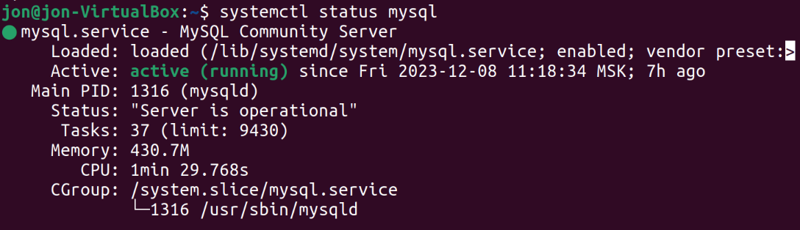

1. Использование команды cat в Linux
   - Создать два текстовых файла: "Pets"(Домашние животные) и "Pack animals"(вьючные животные), используя команду `cat` в терминале Linux. В первом файле перечислить собак, кошек и хомяков. Во втором — лошадей, верблюдов и ослов.
   - Объединить содержимое этих двух файлов в один и просмотреть его содержимое.
   - Переименовать получившийся файл в "Human Friends".
Пример конечного вывода после команды “ls” :
Desktop Documents Downloads  HumanFriends.txt  Music  PackAnimals.txt  Pets.txt  Pictures  Videos

`cat > Pets.txt`

`cat > PackAnimals.txt`

`cat Pets.txt PackAnimals.txt > newfile.txt`

`cat newfile.txt`

`mv newfile.txt HumanFriend.txt`

`ls`

2. Работа с директориями в Linux
   - Создать новую директорию и переместить туда файл "Human Friends".

 `mkdir workdirectory`  

 

3. Работа с MySQL в Linux. “Установить MySQL на вашу вычислительную машину ”
   - Подключить дополнительный репозиторий MySQL и установить один из пакетов из этого репозитория.

`sudo apt udate`

`sudo apt install mysql-server`

`systemctl status mysql`

`wget https://dev.mysql.com/get/mysql-apt-config_0.8.28-1_all.deb`

`sudo dpkg -i mysql-apt-config_0.8.28-1_all.deb`

4. Управление deb-пакетами
   - Установить и затем удалить deb-пакет, используя команду `dpkg`.

`wget http://archive.ubuntu.com/ubuntu/pool/universe/m/mc/mc_4.8.29-2_amd64.deb`

`sudo dpkg -i mc_4.8.29-2_amd64.deb`

`mc`

`sudo dpkg -r mc`

5. История команд в терминале Ubuntu
   - Сохранить и выложить историю ваших терминальных команд в Ubuntu.
В формате: Файла с ФИО, датой сдачи, номером группы(или потока)

[Lyalin_Evgeniy_09-12-23_4544.txt](./Lyalin_Evgeniy_09-12-23_4544.txt)